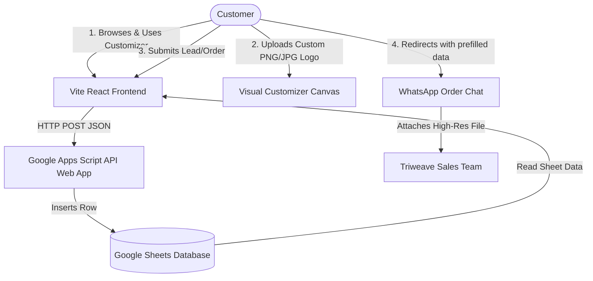

# Triweave Print Xpress: Partner Presentation & Operational Guide

Welcome to the official technical and operational guide for **Triweave Print Xpress**. This document provides you a clear view of how the platform operates, how data is processed, and how you can manage the website's dynamic portfolio without touch-coding.

---

## 📐 System Architecture

The website is designed as a **serverless, high-performance static web application** integrated directly with cloud spreadsheets and WhatsApp. This structure eliminates database hosting costs and provides a robust, easy-to-use control panel for your team.

---

## 🌟 Core Features & Operational Mechanics

### 1. Hero Page & Mockup Collage
*   **Volumetric Aesthetics**: Features custom radial gradients, glassmorphism badges, and neon accents designed to match top-tier streetwear brands.
*   **Holographic Print Simulator**: The main T-shirt mockup on the right features a moving cyan laser line sweep. It transitions between a futuristic grid outline and a fully printed retail mockup to capture immediate customer attention.

### 2. Live Interactive Visualizer (T-Shirt Customizer)
*   **Vector Canvas rendering**: Renders a vector blueprint model of apparel.
*   **Real-time Color Swapping**: Allows customers to swap apparel fabric colors instantly.
*   **Custom Image Upload Previews**: Customers can upload their own logo or art file (`.png`, `.jpg`, `.svg`) and preview it instantly on the chest area of the customized t-shirt.
*   **Estimated Base Pricing**: Dynamic pricing engine that changes based on order quantity, size selection (Standard vs Kids), and fabric weight, keeping customer expectations aligned.

### 3. Automated CMS Works Gallery
*   **Dynamic Data Hydration**: The portfolio images in the "Gallery" section are not hardcoded. The page automatically fetches the list of printed apparel from your Google Sheet.
*   **Interactive Lightbox**: Users can zoom in on portfolio works, browse them with slider chevrons, and click a button to pre-fill their quote request form based on that specific item.

---

## 📊 Google Sheets Backend Integration

Instead of paying for expensive SQL databases and cloud hosting, the platform uses a **Google Sheet** as its administrative database. This connection is mediated by a secure Google Apps Script Web App URL.

### Sheet Structure
Your Google Sheet contains three sheets:
1.  `Leads`: Records customer name, phone number, email, desired print service, and message from the contact page.
2.  `Orders`: Captures detailed customized items, selected colors, sizes, uploaded design indicators, quantities, and order totals from the cart checkout.
3.  `Gallery`: Controls the image assets shown in the homepage portfolio catalog.

---

## 🖼️ How to Insert Portfolio Images in the Gallery

You and your partners can update the website's works portfolio instantly by modifying the `Gallery` tab in your Google Sheet. The website updates in real-time without recompiling any code.

### Step-by-Step Instructions:

1.  **Host your Image File**:
    *   Upload the photo of your custom print (e.g., a customer's hoodie, a screen-printed polo) to a free hosting service. We recommend using **Cloudinary** or a shared Google Drive/Dropbox direct link.
    *   *Cloudinary tip*: Copy the "Direct URL" (which usually ends in `.png` or `.jpg`).
2.  **Add a Row to the Sheet**:
    *   Open your Triweave Admin Google Sheet and click the **Gallery** sheet tab.
    *   Fill in the columns for a new row:
        *   **id**: (Enter any unique number, e.g., `11`, `12`, or let it auto-increment).
        *   **title**: The display name for the product (e.g., `Premium Chennai Wolves Hoodie`).
        *   **category**: Input either `tees`, `polos`, or `hoodies`. *Note: The filter categories on the website auto-adjust based on whatever categories you type here.*
        *   **printMethod**: Enter the print process used (e.g., `DTF Print`, `Screen Print`, `Embroidery`).
        *   **url**: Paste the direct image link you copied in Step 1.
3.  **Result**:
    *   The website automatically reads the updated rows and populates the portfolio with the new image, title, and badge filters immediately.

---

## 👕 How Customer Custom Logo Uploads Work

To ensure customers can easily preview their ideas before submitting a quote, we designed a simple, client-side visual overlay:

1.  **Visual Placement**:
    *   When a customer clicks "Upload Design Logo" inside the customizer pane, the browser loads their image locally.
    *   It renders it as a centered layer on top of the vector T-shirt, automatically scaling it to fit the chest print guidelines.
2.  **Local Persistence**:
    *   The uploaded image is temporarily stored in the browser's memory (`localStorage`) so that if they customize other details or navigate, the uploaded logo remains intact.
3.  **Seamless Checkout Redirection**:
    *   Since browsers limit the transfer of large raw files directly to WhatsApp URLs, the checkout system indicates that a **"Custom Uploaded Design is attached"** in the order payload.
    *   The checkout final page directs the user to the WhatsApp channel with all sizes, colors, and quantities pre-filled, and instructs the customer to: *"Please attach your high-resolution original logo/graphic file in this chat box."*
    *   This ensures your print operators receive the raw print-ready asset directly in the conversation.

---

## 🚀 Deployment & Free Hosting

The website is ready to deploy on **Vercel** under their free-tier program. 

### Why Vercel?
*   **Zero Cost**: Free hosting for static frontend SPA builds.
*   **Fast Load Times**: Globally distributed CDN ensures the page loads instantly in Chennai and elsewhere.
*   **Instant Updates**: Every time you commit code changes to your GitHub repository, Vercel automatically rebuilds and publishes the website.

### Deployment Guide:
1.  Connect your GitHub account to [Vercel.com](https://vercel.com).
2.  Click **Import Project** and select `TRIWEAVE_Ecomm`.
3.  Vercel automatically detects the **Vite** configuration. Click **Deploy**.
4.  Once deployed, configure your custom domain (e.g., `triweavexpress.com` or similar) in the Vercel dashboard settings under the **Domains** tab.
